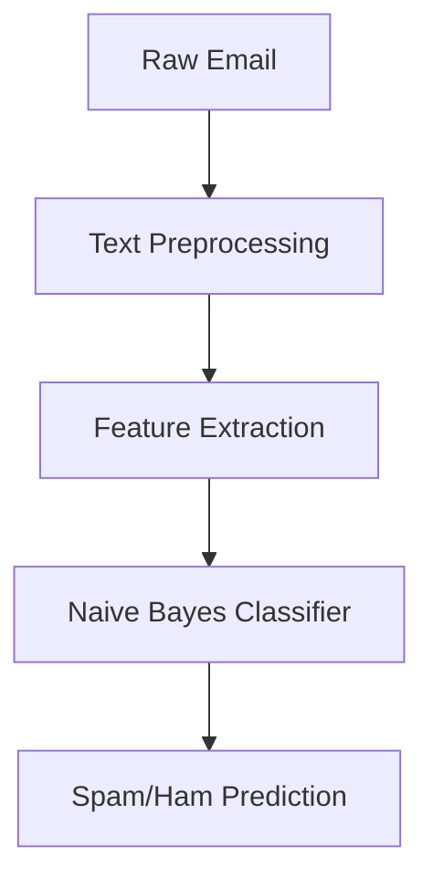

# Email Spam Detection System ✉️🛡️


## 🌟 Features
- 95% accurate spam detection
- Real-time email classification
- Natural Language Processing (NLP) pipeline
- Interactive probability visualization
- Support for multiple email formats

## 🚀 Quick Start
### Prerequisites
- Python 3.8+
- pip package manager

### Installation
```bash
git clone https://github.com/Akashka27/Email-Spam-Detection.git
cd Email-Spam-Detection
pip install -r requirements.txt
```
### Launch App
```bash
streamlit run app.py
```

## 📊 Dataset
**Spam Collection Dataset**
📥 Combined from various public sources including:

Enron-Spam datasets

SpamAssassin public corpus

Custom collected samples**  
📥 [Download Dataset](data/diabetes.csv)

## 🧠 Model Architecture


## 🖼️ Screenshots


## 🤝 Contributing
Pull requests welcome! Please open an issue first.

## 📜 License
MIT © Akash 
